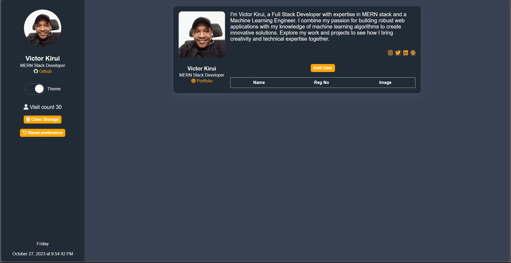
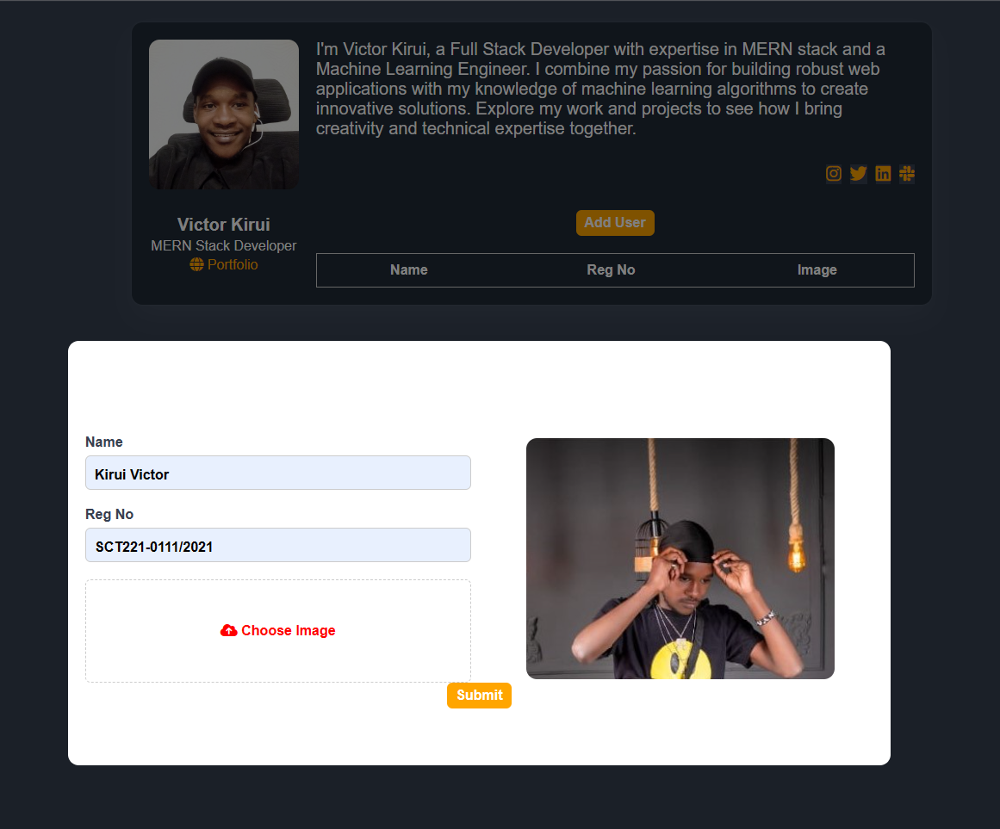
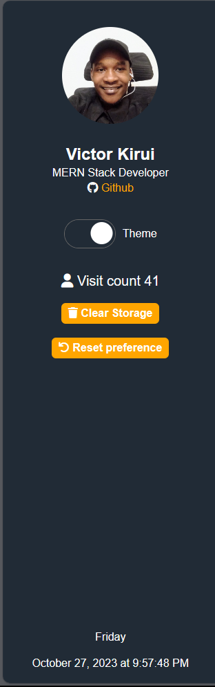
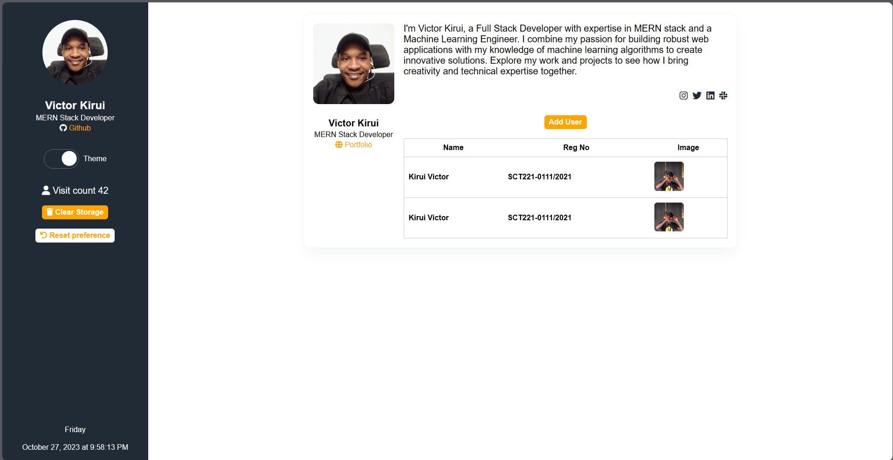
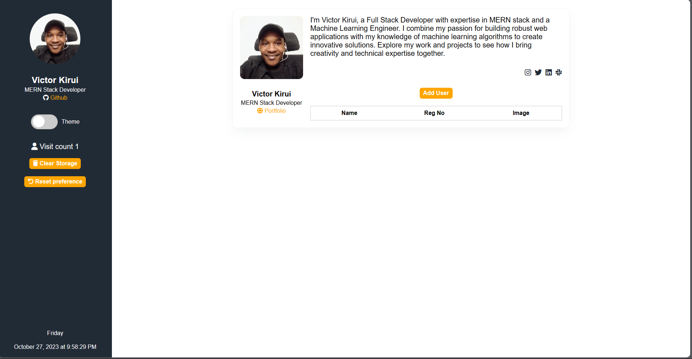

# LAB 1 WEB APPLICATION DEVELOPMENT/ ENTERPRISE WEB APPLICATION DEVELOPMENT

<!-- TABLE OF NAME REGNO PASSPORT -->
| NAME | REG NO | PASSPORT |
| --- | --- | --- |
| VICTOR KIPKORIR KIRUI | SCT221-0111/2021 |  |

<!-- TABLE OF CONTENTS -->
## About The Project

This is a web application for demonstrating the use of local storage in DOM manipulation. I have implimented the following features:
 - Local storage 
    - Local storage creation
    - Local storage update  
    - Local storage deletion
    - Local storage retrieval
    - Local storage clear
- Preference storage
    - Preference storage creation
    - Preference storage update  
    - Preference storage deletion
    - Preference storage retrieval
    - Preference storage clear
- Visit counter

### Built With
This project was built with the following technologies
* [HTML](https://www.w3schools.com/html/)
* [CSS](https://www.w3schools.com/css/)
* [JavaScript](https://www.w3schools.com/js/)
* [FontAwesome](https://fontawesome.com/)
* [Google Fonts](https://fonts.google.com/)

<!-- GETTING STARTED -->
## Getting Started

To get a local copy up and running follow these simple steps.

### Prerequisites

You need to have a browser installed on your machine. I recommend using [Google Chrome](https://www.google.com/chrome/)
### Installation

1. Clone the repo
   ```sh
   git clone 












