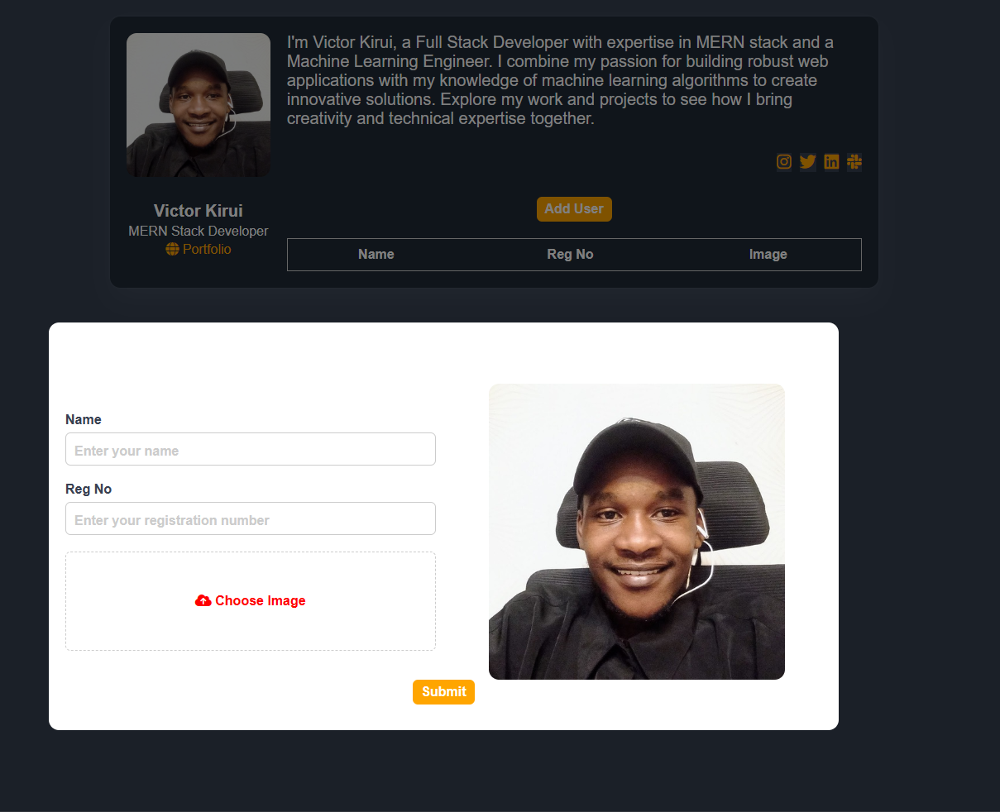

# LAB 1 WEB APPLICATION DEVELOPMENT/ ENTERPRISE WEB APPLICATION DEVELOPMENT

| NAME                  | REG NO           | PASSPORT                 |
| --------------------- | ---------------- | ------------------------ |
| VICTOR KIPKORIR KIRUI | SCT221-0111/2021 |  |

## Link to webpage

[Github Link](https://github.com/Techsupport254/Intern)

[Web Page Link](https://techsupport254.github.io/Intern/) or Click 👇👇

[](https://techsupport254.github.io/Intern/)

https://github.com/Techsupport254/Intern

## About The Project

This is a web application for demonstrating the use of local storage in DOM manipulation. I have implimented the following features:

- Local storage
  - Local storage creation
  - Local storage update
  - Local storage deletion
  - Local storage retrieval
  - Local storage clear
- Preference storage
  - Preference storage creation
  - Preference storage update
  - Preference storage deletion
  - Preference storage retrieval
  - Preference storage clear
- Visit counter

### Built With

This project was built with the following technologies

- [HTML](https://www.w3schools.com/html/)
- [CSS](https://www.w3schools.com/css/)
- [JavaScript](https://www.w3schools.com/js/)
- [FontAwesome](https://fontawesome.com/)
- [Google Fonts](https://fonts.google.com/)

## Getting Started

To get a local copy up and running follow these simple steps.

### Prerequisites

You need to have a browser installed on your machine. I recommend using [Google Chrome](https://www.google.com/chrome/)

### Installation

1. Clone the repo
   ```sh
   git clone https://github.com/Techsupport254/Intern.git
   ```
2. Open the index.html file in your browser
   ```sh
   index.html
   ```
3. You can now use the application

## SCREENSHOTS

i.) Home page

- Light mode


- Dark mode


ii.) Local storage

- Before adding a new item


- Modal for adding a new item



- Preview of the new item


- After adding a new item

* Displaying the new item in the table


iii.) Side bar

- Displaying the number of visits
- Button for clearing local storage
- Button for clearing preference storage


iv.) Preference storage clear


v.) Local storage clear


